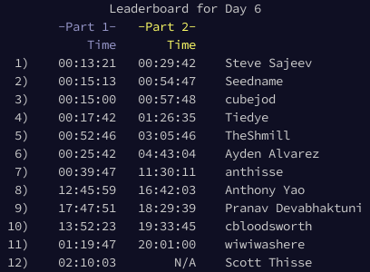

# Advent of Code Discord Leaderboard

## Overview
Posts images of the Advent of Code Leaderboard to a channel daily via a Discord webhook. The daily leaderboard is ordered by the time taken to solve Part 2 and Part 1. The overall leaderboard is ordered by local score.

Hosted via **AWS Lambda**.

## Setup
### Setting up `.env`
`TEST_MODE` can be set to `True` or `False`. If `True`, leaderboard data is received via a local `JSON` file; otherwise, a request is made to the Advent of Code API.

`SESSION_COOKIE` is the cookie from accessing the Advent of Code website.
> Note: `SESSION_COOKIE` typically expires after a month, but that should be long enough for Advent of Code (December)

`PRIVATE_LEADERBOARD_CODE` is the prefix of the leaderboard join code. For example, if your join code is `#####-ABCDEF`, the `PRIVATE_LEADERBOARD_CODE` is `#####`.

`WEBHOOK_URL` is the Discord webhook url for the channel.

### Installing packages
```console
pip install -r requirements.txt
```

## Image Preview
### Daily Leaderboard

### Overall Leaderboard
